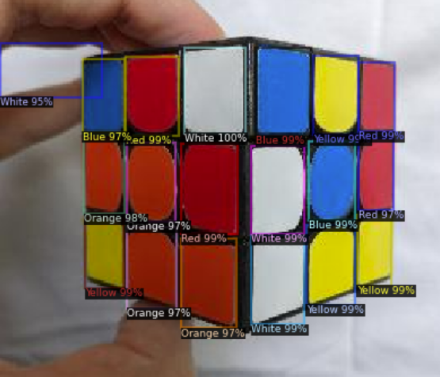
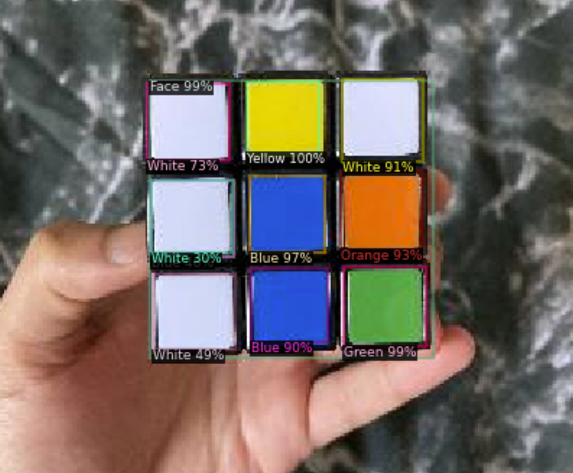
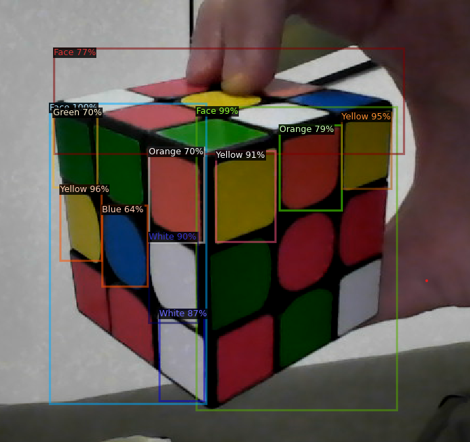
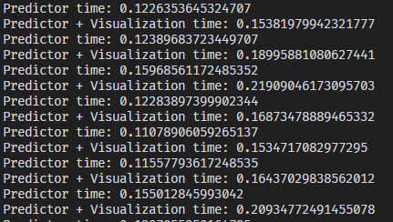
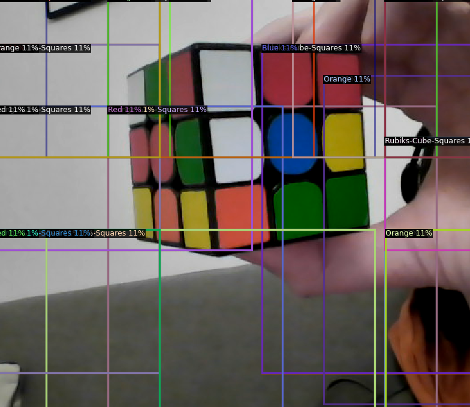
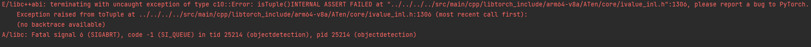

# Development trouble with Detectron2 and D2GO

TODO add metrics?

When researching deep learning models to detect individual squares of a rubik's cube, Detectron2 and the mobile optimised D2GO seemed very promising.

## Detecton2

After trying out demos and tutorials, Detectron2 give very promising results accuracy. These results were trained with our own data set, with the `faster_rcnn_R_101_C4_3x` model. Some note worthy configs: 
```python
cfg.SOLVER.IMS_PER_BATCH = 4
cfg.SOLVER.BASE_LR = 0.00025
cfg.SOLVER.MAX_ITER = 1000
cfg.SOLVER.STEPS = []        
cfg.MODEL.ROI_HEADS.BATCH_SIZE_PER_IMAGE = 256
cfg.MODEL.ROI_HEADS.NUM_CLASSES = 7
```

Gave these results:



Very promising, however, with an inference time on my laptop (running on cpu, i7 processor) of around **4s**, its not suitable for live demos. 

This model was a proof of concept to understand detectron2 and its performance doesn't matter, since we were aiming to use d2go's mobile optimised backbones.

## D2go

Training on d2go was as simple as detectron2, however, getting correct package dependencies was quite the challenge.

It requires python version 3.8, which for example, Google Colab doesn't run on (runs on 3.7). Our school servers run 3.6, so are no help either. After difficulties installing on Windows due to d2go calling a signal unsupported in windows, I trained a model on my laptop's CPU. This was extremely slow to train, and even then, didn't match any GPU result I would later get.

I eventually opted for a Paperspace Gradient notebook which allowed me to train d2go models successfully on their free GPUs.

This gave very promising results, trained with the `faster_rcnn_fbnetv3a_C4` model (the faster `FPN` model could have been even more preferable). Some note worthy configs:

```python
cfg.SOLVER.IMS_PER_BATCH = 6 
cfg.SOLVER.BASE_LR = 0.00025
cfg.SOLVER.MAX_ITER = 1000
cfg.MODEL.ROI_HEADS.BATCH_SIZE_PER_IMAGE = 512 # 512   
cfg.MODEL.ROI_HEADS.NUM_CLASSES = 8
```

Here, the face of the cube is also being detected:




Inference times (running the model on my laptop's i7 processor):



Prediction/inference time is about 0.12s.
With the rendering of prediction info (visualisations), about 0.18s

The inference for this is much better than Detectron2, but with quantisation it would be much faster while losing a bit of accuracy. It could be optimized with a light(er)weight model from model_zoo to run on a desktop, but it's meant to be deployable on a phone.

## D2go Mobile Trouble

Quanisation was a struggle. D2GO's has a complete lack of documentation. There's some inline documentation within the source code of the package, and some tutorials that are a few years old and take a good bit of converting to the newer D2GO package.

Following tutorials from:
 - https://gilberttanner.com/blog/d2go-use-detectron2-on-mobile-devices/
 - https://github.com/pytorch/android-demo-app/tree/master/D2Go

and trudging through the source code of d2go to debug errors, I finally managed to get quantisation working. I had a quantised model, which had a lot of accuracy loss, but a model was a model so I carried on with it for the moment to see if I could get it on a phone.



Next is to convert this to a pytorch model to deploy within an android app. Following the example file from pytorch [here](https://github.com/pytorch/android-demo-app/blob/master/D2Go/create_d2go.py), I got a pytorch model.


Running this on the demo android app pytorch gives in their [repo](https://github.com/pytorch/android-demo-app), resulted in an error...



With pytorch not updating this demo app in a year, and there being no posted answers to this error (with only one post, which is a current open issue on pytorch's github repo), I wasn't sure how to fix it. 

Potentially a version mis-match between the android app and the model could have been the issue. Installing the dependencies used around the time some tutorials for d2go was something I tried. D2go's repo has no version tags, so I had to scroll through endless commits to install it and mobile vision from a specific commit, while detectron2 (which d2go is dependant on), hasn't updated a version tag in a year...

None of this worked, with days waisted due to the extreme lack of documentation and support for d2go and it's mobile deployment. For these reasons, TFL seems to be a much better option.  

